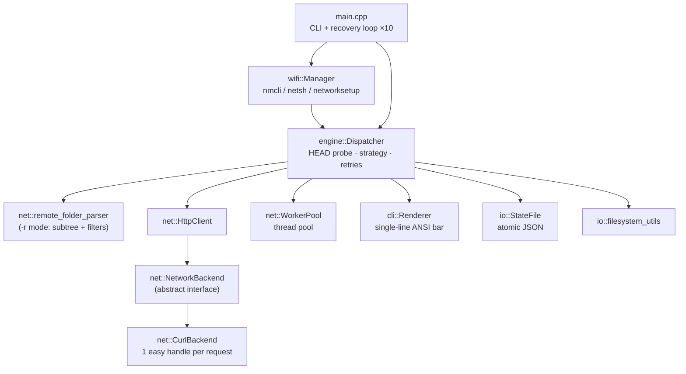

<div align="center">

# ⚡ Lux

**A robust CLI file downloader — that downloads *no matter what***

*C++20 · libcurl · No heavy dependencies · Cross-platform*


</div>

---

**Lux** is a command-line tool that downloads files robustly: whenever a
connection fails (timeout, dropped network, server cut), it **retries with
exponential backoff and resumes via HTTP Range from the last byte received**,
until the file is fully downloaded. While downloading, it shows a real-time
progress bar on a **single terminal line**: percentage, volume, speed and
estimated time remaining.

It was born from a simple need: *"normally, if a download is in progress and
the connection fails, you have to start over. This project must guarantee the
file gets downloaded, period."*

> 🌐 This document is also available in
> [Spanish (README_ES.md)](README_ES.md).

---

## ✨ Features

### Reliability

| | |
|---|---|
| 🔁 **Exponential-backoff retries** | Timeout, refused or reset connection → exponential retry (1s→30s, up to 60s when the network is down). |
| ⏸️ **Range-based resume** | Continues from the exact byte where it left off (`-c`). Progress is persisted in `<file>.luxstate.json` with atomic writes. |
| 🧭 **Error classification** | Distinguishes a nonexistent DNS entry (aborts, no infinite loop) from a downed network (retries hard). |
| 🔄 **Global recovery loop** | If a full round fails, `main` automatically resumes for up to 10 rounds. |

### Performance

| | |
|---|---|
| 🧵 **Multi-threaded ranged download** | Files ≥ 8 MiB are split across N threads (`-t`); each thread writes at its exact offset into a pre-allocated file. **Verified corruption-free with MD5**. |
| 🔗 **Keep-alive & compression** | libcurl backend with automatic `Accept-Encoding` (gzip/deflate), redirects and SSL verification. |
| ⏱️ **No hard total timeout** | 15 s connect timeout + stall detection (aborts if the server stops sending for 30 s), for large files on slow links. |

### Functionality

| | |
|---|---|
| 📁 **Recursive download** | `-r` walks HTTP directory listings (Apache/nginx): respects the **subtree of the base URL**, filters anchors, web assets (css/js/fonts/icons) and external domains, and **preserves the local hierarchy**. |
| 🌐 **Single HTML pages** | A web page URL is saved as an `.html` file. |
| 📡 **Automatic Wi-Fi reconnection** | `-w <ssid> [pw]` reconnects when the network drops: `nmcli` (Linux/Termux), `netsh wlan` (Windows), `networksetup` (macOS), with real connectivity checks (DNS). |
| 📊 **Single-line progress** | `\r` + ANSI at 10 Hz: bar, %, bytes, speed and ETA. Without a TTY, it degrades to periodic lines. |

---

## 📊 Demo

```text
[*] Lux 1.0.0
[*] URL: https://proof.ovh.net/files/10Mb.dat
[*] Destination: /tmp/final.dat
[*] Downloading: final.dat
[*] Parallel mode: 4 threads, 10.0 MiB
[*] final.dat [██████████████████████████████] 100.0%  10.0 MiB/10.0 MiB  150.9 KiB/s
[✓] Completed: /tmp/final.dat (10.0 MiB)
[✓] Download finished in 39s
```

Resuming after a cut (without re-downloading what was already received):

```text
$ truncate -s 3000000 partial.dat        # the "cut" leaves 3 MB
$ lux -u https://proof.ovh.net/files/10Mb.dat -o partial.dat -c
[*] Continuing download from saved point.
[*] partial.dat [██████████████████████████████] 100.0%  10.0 MiB/10.0 MiB  103.7 KiB/s
$ md5sum partial.dat                     # → identical to the original ✅
```

---

## 📦 Pre-built binaries

Pre-compiled binaries are attached to each
[GitHub Release](https://github.com/ramirezpupol/lux/releases/latest)
(built automatically by CI on every tagged release, `v*`):

| File | Platform | Notes |
|------|----------|-------|
| `lux-linux-amd64.tar.gz` | Linux x86-64 | Static libstdc++/libgcc; needs `libcurl` present |
| `lux-linux-arm64.tar.gz` | Linux ARM64 (RPi 4/5, ARM servers) | Static libstdc++/libgcc |
| `lux-windows-amd64.zip` | Windows x86-64 | Native MSVC build, SSL bundled |
| `lux-macos-arm64.tar.gz` | macOS Apple Silicon (M1/M2/M3/M4) | Universal-ready |
| `lux-macos-amd64.tar.gz` | macOS Intel | |
| `lux-termux-{arch}.deb` | Android (Termux) | Installs to `$PREFIX/bin` via `apt`/`dpkg` |
| `sha256sums.txt` | — | Checksums for every artifact |

Quick install on Linux:

```bash
curl -sL https://github.com/ramirezpupol/lux/releases/latest/download/lux-linux-amd64.tar.gz \
  | tar xz && sudo mv lux /usr/local/bin/
```

### Termux (Android)

**Option A — one-line installer script** (adds the deb, installs the binary,
and verifies it runs):

```bash
curl -sSL https://raw.githubusercontent.com/ramirezpupol/lux/main/scripts/install-termux.sh | bash
```

**Option B — manual deb install**:

```bash
pkg install dpkg   # if not already present
curl -sLO https://github.com/ramirezpupol/lux/releases/latest/download/lux-termux-aarch64.deb
dpkg -i lux-termux-aarch64.deb
lux --help
```

The deb ships the binary plus a short man-style help page under
`$PREFIX/share/doc/lux/`.

---

## 🚀 Install from source

### Requirements

- **C++20** compiler: GCC ≥ 11 · Clang ≥ 12 · MSVC 2019+
- **CMake ≥ 3.14**
- **libcurl** (recommended; if missing, the HTTP backend compiles as a *stub*)
- Optional: `pkg-config` and `libnm-dev` (Wi-Fi via native NetworkManager on Linux)

### Linux (Debian/Ubuntu)

```bash
sudo apt install build-essential cmake libcurl4-openssl-dev

git clone https://github.com/<your-user>/lux.git
cd lux
cmake -S . -B build -DCMAKE_BUILD_TYPE=Release
cmake --build build --config Release -j$(nproc)
./build/lux --help
```

<details>
<summary><b>Static build (portable binary)</b></summary>

```bash
cmake -S . -B build_static -DCMAKE_BUILD_TYPE=Release \
      -DCMAKE_EXE_LINKER_FLAGS="-static-libstdc++ -static-libgcc"
cmake --build build_static --config Release
```
</details>

### Windows

<details open>
<summary><b>MSVC (Visual Studio 2022)</b></summary>

```bat
cmake -S . -B build\win -G "Visual Studio 17 2022" -A x64
cmake --build build\win --config Release
:: → build\win\Release\lux.exe
```
</details>

<details>
<summary><b>MinGW-w64</b></summary>

```bat
cmake -S . -B build\win -G "MinGW Makefiles" -DCMAKE_BUILD_TYPE=Release
cmake --build build\win --config Release
```
On Windows, Wi-Fi reconnection uses `netsh wlan` (libnm not required).
</details>

### macOS

```bash
brew install cmake curl
cmake -S . -B build -DCMAKE_BUILD_TYPE=Release
cmake --build build --config Release
# → build/lux  (Wi-Fi via networksetup)
```

### Android (Termux)

```bash
pkg update && pkg install clang cmake make libcurl
cmake -S . -B build -DCMAKE_BUILD_TYPE=Release
cmake --build build --config Release
# The binary runs natively in Termux; Wi-Fi via nmcli (optional termux-api)
```

### CMake options

| Option | Default | Description |
|--------|---------|-------------|
| `LUX_ENABLE_CURL` | `ON` | libcurl HTTP backend. Without it, downloads become a stub. |
| `LUX_ENABLE_WIFI` | `OFF` | Links libnm and defines `LUX_HAS_NETWORKMANAGER`. |
| `BUILD_TESTS` | `OFF` | Builds tests (requires `tests/` subdirectory). |
| `BUILD_CLIENT` | `ON` | Builds the `lux` executable. |

---

## 📖 Usage

```text
lux --url <URL> --output <path> [options...]
```

| Option | Description |
|--------|-------------|
| `-u, --url <url>` | File URL (or listing URL, with `-r`) |
| `-o, --output <path>` | Destination: file, or base folder in `-r` mode |
| `-r, --recursive` | Recursive download of a directory listing |
| `-w, --wifi <ssid> [pw]` | SSID and optional password for reconnection |
| `-t, --threads <n>` | Parallel download threads (default: 4) |
| `-p, --processes <n>` | Reserved: inter-process parallelism |
| `-c, --continue` | Resume an interrupted download |
| `-v, --verbose` | Detailed logging (retries, backoff) |
| `-q, --quiet` | Silence messages; keep the progress bar |
| `-h, --help` | Help |

### Examples

```bash
# Large ISO with 8 threads
lux -u https://example.com/debian-12.iso -o ./debian.iso -t 8

# Resume after a cut
lux -u https://example.com/debian-12.iso -o ./debian.iso -c

# Complete remote folder, preserving the hierarchy
lux -u https://archive.ubuntu.com/ubuntu/dists/noble/main/ -o ./main -r

# Quiet listing (clean progress only)
lux -u https://example.com/a.zip -o a.zip -q

# With automatic Wi-Fi reconnection (password optional for open networks)
lux -u https://example.com/a.zip -o a.zip -w "MyNetwork" "my_password"

# Save a web page
lux -u https://example.com -o page.html
```

### Progress bar

```text
[*] file.iso [████████████░░░░░░░░░░░░░░░░░░] 42.8%  4.4 MiB/10.0 MiB  1.2 MiB/s  ETA 00:05
```

- Unicode bar `█/░`, resizable (`Renderer::set_width`).
- Updated at **10 Hz** (doesn't saturate the terminal).
- **ETA** and speed measured from the start of the current download.
- Without a TTY (pipe/redirect): prints periodic lines instead.
- When done, restores the cursor and clears the line with `finish()`.

---

## 🗃️ State file

Progress is persisted next to the target as `<name>.luxstate.json`
(atomic write: it is written to `.tmp` first, then `rename`d):

```json
[
    {
        "url": "https://example.com/a.zip",
        "output_path": "a.zip",
        "bytes_downloaded": 5242880,
        "is_recursive": false,
        "last_error": "",
        "retry_count": 0,
        "threads": 4
    }
]
```

If the JSON is corrupted, Lux warns and continues from scratch.
`StateFile::open()` derives the path automatically from `--output`.

---

## 🏗️ Architecture



### Download flow

1. `main` parses the CLI; if an SSID is given, `wifi::Manager::connect_if_needed()`
   verifies real connectivity (DNS resolution) and reconnects if needed.
2. `Dispatcher::probe()` issues a `HEAD`: total size, `Accept-Ranges`,
   `Content-Type`.
3. **Strategy**:
   - HTML + `-r` → recursion limited to the root URL's subtree.
   - Large + ranges → `download_parallel`: pre-allocates the file and splits
     ranges across threads; each thread retries **its own range** with backoff.
   - Otherwise → `download_sequential` with `Range: bytes=<existing>-`.
4. Threads aggregate their progress and `cli::Renderer` draws the single line.
5. At the end, `StateFile` persists the outcome for future resumes.

### Error classification

| Message (curl) | Class | Action |
|----------------|-------|--------|
| `Timeout was reached` | 1 · timeout | Retry with backoff |
| `Couldn't resolve host` | 0 · fatal | **Abort** (the URL does not exist) |
| `Network is unreachable` / `Connection reset/refused` | 2 · network | Backoff ×2 (up to 60 s) |
| `Resolving timed out` | 2 · network | Strong retry (possible Wi-Fi drop) |
| Other | 0 · fatal | Abort |

### Source tree

```
src/
├── main.cpp                    CLI, argument parsing, recovery loop
├── engine/
│   ├── dispatcher.{hpp,cpp}    probe, parallel ranged download, resume,
│   │                           recursion, progress, error classification
│   ├── progress_tracker.{hpp,cpp}   global tracker (singleton)
│   └── types.{hpp,cpp}         Progress, DownloadState, lux_error, constants
├── net/
│   ├── backend.{hpp,cpp}       NetworkBackend interface + factory
│   ├── curl_backend.{hpp,cpp}  thread-safe libcurl backend
│   ├── http_client.{hpp,cpp}   client on top of a shared backend
│   ├── workers.{hpp,cpp}       WorkerPool (producer/consumer)
│   ├── remote_folder_parser.{hpp,cpp}  HTML listings → resources
│   ├── error.{hpp,cpp}         NetError + errno classification
│   ├── version.{hpp,cpp}       project version
│   ├── network_manager.*       (early phase; live flow uses Dispatcher)
│   └── ssl_utils.hpp           OpenSSL utilities
├── io/
│   ├── state_file.{hpp,cpp}    resume state (JSON)
│   ├── filesystem_utils.*      mkdirs, file size, move
│   └── buffer.*                dynamic buffer
├── cli/
│   └── renderer.{hpp,cpp}      ANSI bar, ETA, binary formatting
└── wifi/
    └── manager.{hpp,cpp}       cross-platform reconnection
```

Size: **~2,900 lines** of C++ across 34 first-party files
(+ vendored `include/nlohmann/` for JSON).

---

## 🧪 Verification

Real results measured during development (MD5 checked against the server):

| Test | Result |
|------|--------|
| 249 KiB single HTTP file vs `curl` | ✅ identical MD5 |
| 10 MiB HTTPS, 4 parallel threads | ✅ identical MD5, corruption-free |
| Resume `-c` from 5 MB partials | ✅ identical MD5 (nothing re-downloaded) |
| Apache recursion: **56 files** checked one by one | ✅ 56/56 MD5 |
| Folder hierarchy in `-r` mode | ✅ preserved, no duplicated paths |
| Invalid DNS URL | ✅ aborts in 0.15 s (no retry loop) |
| Single HTML page | ✅ saved |
| Release build | ✅ 0 errors · 0 warnings |

Reproduce the recursion verification:

```bash
lux -u http://archive.ubuntu.com/ubuntu/dists/noble/main/ -o /tmp/rec -r -t 4
BASE="http://archive.ubuntu.com/ubuntu/dists/noble/main/"
cd /tmp/rec && for f in $(find . -type f); do
  [ "$(md5sum "$f" | cut -d' ' -f1)" = "$(curl -s "$BASE${f#./}" | md5sum | cut -d' ' -f1)" ] \
    && echo "OK  ${f#./}" || echo "FAIL ${f#./}"
done
```

---

## 🗺️ Roadmap

- [ ] `-p/--processes`: real inter-process parallelism (progress IPC)
- [ ] CTest test suite (`BUILD_TESTS=ON`)
- [ ] `scripts/build_all.sh` to package all 4 platforms
- [ ] FTP/SFTP support via libcurl
- [ ] Native integrity checks (server-side MD5/SHA256)
- [ ] Granular retry in parallel mode (only the failed range)
- [ ] Windows: CI-built binaries (GitHub Actions)
- [ ] `man` page and shell completion (bash/zsh/fish)

## 🤝 Contributing

1. Fork and create your branch: `git checkout -b feature/my-feature`
2. Build with strict warnings and keep 0 warnings:
   `cmake -S . -B build -DCMAKE_BUILD_TYPE=Release && cmake --build build`
3. Verify with real downloads (see [Verification](#-verification))
4. Clear commits in English or Spanish, and a Pull Request with a description

**Code conventions**: C++20, snake_case file names, camelCase methods,
`// ----` section comments, `#pragma once` headers.

## 📄 License

MIT — free to use, modify and distribute.
