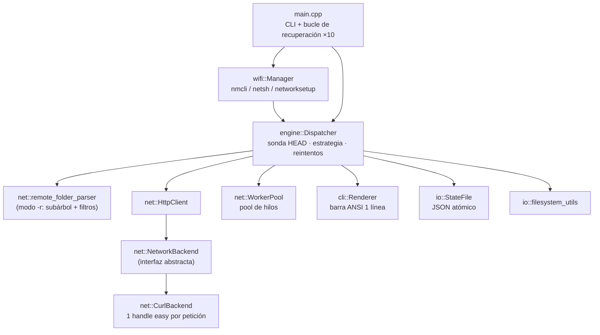

<div align="center">

# ⚡ Lux

**Descargador robusto de archivos por CLI — que lo descarga *sí o sí***

*C++20 · libcurl · Sin dependencias pesadas · Multiplataforma*


</div>

---

**Lux** es una herramienta de línea de comandos que descarga archivos de forma
robusta: ante cualquier fallo de conexión (timeout, red caída, corte del
servidor) **reintenta con backoff exponencial y reanuda por HTTP Range desde
el último byte recibido**, hasta obtener el archivo completo. Mientras
descarga, muestra una barra de progreso en tiempo real en **una sola línea**
del terminal: porcentaje, volumen, velocidad y tiempo restante estimado.

Nació de una necesidad simple: *«normalmente si una descarga está en progreso
y hay un fallo de conexión hay que comenzar de nuevo. Este proyecto garantiza
que el archivo se descargue si o si»*.

> 🌐 Este documento también está disponible en
> [inglés (README_EN.md)](README_EN.md).

---

## ✨ Características

### Fiabilidad

| | |
|---|---|
| 🔁 **Reintentos con backoff** | Timeout, conexión rechazada o reset → reintento exponencial (1s→30s, hasta 60s si la red está caída). |
| ⏸️ **Reanudación por `Range`** | Continúa desde el byte exacto donde quedó (`-c`). El progreso se persiste en `<archivo>.luxstate.json` con escritura atómica. |
| 🧭 **Errores clasificados** | Distingue DNS inexistente (aborta sin bucle) de red caída (reintenta fuerte). |
| 🔄 **Bucle de recuperación global** | Si una ronda completa falla, `main` reanuda automáticamente hasta 10 rondas. |

### Rendimiento

| | |
|---|---|
| 🧵 **Descarga multihilo por rangos** | Archivos ≥ 8 MiB se reparten entre N hilos (`-t`); cada hilo escribe en su desplazamiento exacto sobre un archivo preasignado. **Verificado sin corrupción con MD5**. |
| 🔗 **Keep-alive y compresión** | Backend libcurl con `Accept-Encoding` automático (gzip/deflate), redirecciones y verificación SSL. |
| ⏱️ **Sin timeout total duro** | Timeout de conexión 15 s + detección de estancamiento (aborta si el servidor deja de enviar 30 s), para archivos grandes en conexiones lentas. |

### Funcionalidad

| | |
|---|---|
| 📁 **Descarga recursiva** | `-r` recorre listados HTTP (Apache/nginx): respeta el **subárbol de la URL base**, filtra anclas, assets web (css/js/fuentes/iconos) y dominios externos, y **preserva la jerarquía local**. |
| 🌐 **HTML individual** | Una URL de página web se guarda como `.html`. |
| 📡 **Reconexión Wi-Fi** | `-w <ssid> [pw]` reconecta si cae la red: `nmcli` (Linux/Termux), `netsh wlan` (Windows), `networksetup` (macOS), con verificación real de conectividad (DNS). |
| 📊 **Progreso de una línea** | `\r` + ANSI a 10 Hz: barra, %, bytes, velocidad y ETA. Sin TTY, se degrada a líneas periódicas. |

---

## 📊 Demo

```text
[*] Lux 1.0.0
[*] URL: https://proof.ovh.net/files/10Mb.dat
[*] Destino: /tmp/final.dat
[*] Descargando: final.dat
[*] Modo paralelo: 4 hilos, 10.0 MiB
[*] final.dat [██████████████████████████████] 100.0%  10.0 MiB/10.0 MiB  150.9 KiB/s
[✓] Completado: /tmp/final.dat (10.0 MiB)
[✓] Descarga finalizada en 39s
```

Reanudación tras un corte (sin re-descargar lo ya recibido):

```text
$ truncate -s 3000000 parcial.dat        # el "corte" deja 3 MB
$ lux -u https://proof.ovh.net/files/10Mb.dat -o parcial.dat -c
[*] Continuando descarga desde el punto guardado.
[*] parcial.dat [██████████████████████████████] 100.0%  10.0 MiB/10.0 MiB  103.7 KiB/s
$ md5sum parcial.dat                     # → idéntico al original ✅
```

---

## 🚀 Instalación

### Requisitos

- Compilador **C++20**: GCC ≥ 11 · Clang ≥ 12 · MSVC 2019+
- **CMake ≥ 3.14**
- **libcurl** (recomendado; si falta, el backend HTTP compila como *stub*)
- Opcional: `pkg-config` y `libnm-dev` (Wi-Fi vía NetworkManager nativo en Linux)

### Linux (Debian/Ubuntu)

```bash
sudo apt install build-essential cmake libcurl4-openssl-dev

git clone https://github.com/<tu-usuario>/lux.git
cd lux
cmake -S . -B build -DCMAKE_BUILD_TYPE=Release
cmake --build build --config Release -j$(nproc)
./build/lux --help
```

<details>
<summary><b>Build estático (binario portable)</b></summary>

```bash
cmake -S . -B build_static -DCMAKE_BUILD_TYPE=Release \
      -DCMAKE_EXE_LINKER_FLAGS="-static-libstdc++ -static-libgcc"
cmake --build build_static --config Release
```
</details>

### Windows

<details open>
<summary><b>MSVC (Visual Studio 2022)</b></summary>

```bat
cmake -S . -B build\win -G "Visual Studio 17 2022" -A x64
cmake --build build\win --config Release
:: → build\win\Release\lux.exe
```
</details>

<details>
<summary><b>MinGW-w64</b></summary>

```bat
cmake -S . -B build\win -G "MinGW Makefiles" -DCMAKE_BUILD_TYPE=Release
cmake --build build\win --config Release
```
En Windows, la reconexión Wi-Fi usa `netsh wlan` (no requiere libnm).
</details>

### macOS

```bash
brew install cmake curl
cmake -S . -B build -DCMAKE_BUILD_TYPE=Release
cmake --build build --config Release
# → build/lux  (Wi-Fi vía networksetup)
```

### Android (Termux)

```bash
pkg update && pkg install clang cmake make libcurl
cmake -S . -B build -DCMAKE_BUILD_TYPE=Release
cmake --build build --config Release
# El binario corre nativamente en Termux; Wi-Fi vía nmcli (termux-api opcional)
```

### Opciones de CMake

| Opción | Defecto | Descripción |
|--------|---------|-------------|
| `LUX_ENABLE_CURL` | `ON` | Backend HTTP libcurl. Sin él, las descargas quedan como stub. |
| `LUX_ENABLE_WIFI` | `OFF` | Enlaza libnm y define `LUX_HAS_NETWORKMANAGER`. |
| `BUILD_TESTS` | `OFF` | Compila los tests (requiere subdirectorio `tests/`). |
| `BUILD_CLIENT` | `ON` | Construye el ejecutable `lux`. |

---

## 📖 Uso

```text
lux --url <URL> --output <ruta> [opciones...]
```

| Opción | Descripción |
|--------|-------------|
| `-u, --url <url>` | URL del archivo (o del listado, con `-r`) |
| `-o, --output <ruta>` | Destino: fichero, o carpeta base en modo `-r` |
| `-r, --recursive` | Descarga recursiva de un listado de carpeta |
| `-w, --wifi <ssid> [pw]` | SSID y contraseña opcional para reconexión |
| `-t, --threads <n>` | Hilos de descarga paralela (defecto: 4) |
| `-p, --processes <n>` | Reservado: paralelismo entre procesos |
| `-c, --continue` | Reanudar una descarga interrumpida |
| `-v, --verbose` | Registro detallado (reintentos, backoff) |
| `-q, --quiet` | Silencia mensajes; deja el progreso |
| `-h, --help` | Ayuda |

### Ejemplos

```bash
# ISO grande con 8 hilos
lux -u https://ejemplo.com/debian-12.iso -o ./debian.iso -t 8

# Reanudar tras un corte
lux -u https://ejemplo.com/debian-12.iso -o ./debian.iso -c

# Carpeta remota completa preservando jerarquía
lux -u https://archive.ubuntu.com/ubuntu/dists/noble/main/ -o ./main -r

# Solo listado silencioso (progreso limpio)
lux -u https://ejemplo.com/a.zip -o a.zip -q

# Con reconexión Wi-Fi automática (contraseña opcional para redes abiertas)
lux -u https://ejemplo.com/a.zip -o a.zip -w "MiRed" "mi_contraseña"

# Guardar una página web
lux -u https://example.com -o pagina.html
```

### Barra de progreso

```text
[*] archivo.iso [████████████░░░░░░░░░░░░░░░░░░] 42.8%  4.4 MiB/10.0 MiB  1.2 MiB/s  ETA 00:05
```

- Barra Unicode `█/░` con redimensionado (`Renderer::set_width`).
- Actualización a **10 Hz** (no satura la terminal).
- **ETA** y velocidad medidos desde el inicio de la descarga actual.
- Sin TTY (pipe/redirección): imprime líneas periódicas en su lugar.
- Al terminar, restaura el cursor y limpia la línea con `finish()`.

---

## 🗃️ Archivo de estado

El progreso se persiste junto al destino como `<nombre>.luxstate.json`
(escritura atómica: se escribe a `.tmp` y se hace `rename`):

```json
[
    {
        "url": "https://ejemplo.com/a.zip",
        "output_path": "a.zip",
        "bytes_downloaded": 5242880,
        "is_recursive": false,
        "last_error": "",
        "retry_count": 0,
        "threads": 4
    }
]
```

Si el JSON está corrupto, Lux avisa y continúa con descarga desde cero.
`StateFile::open()` deriva la ruta automáticamente desde `--output`.

---

## 🏗️ Arquitectura



### Flujo de una descarga

1. `main` parsea la CLI; si hay SSID, `wifi::Manager::connect_if_needed()`
   verifica conectividad real (resolución DNS) y reconecta si hace falta.
2. `Dispatcher::probe()` hace `HEAD`: tamaño total, `Accept-Ranges`,
   `Content-Type`.
3. **Estrategia**:
   - HTML + `-r` → recursión limitada al subárbol de la URL raíz.
   - Grande + rangos → `download_parallel`: preasigna el archivo y reparte
     rangos entre hilos; cada hilo reintenta **su rango** con backoff.
   - Si no → `download_sequential` con `Range: bytes=<existente>-`.
4. Los hilos agregan su progreso y `cli::Renderer` dibuja la línea única.
5. Al final, `StateFile` persiste el resultado para futuras reanudaciones.

### Clasificación de errores

| Mensaje (curl) | Clase | Acción |
|----------------|-------|--------|
| `Timeout was reached` | 1 · timeout | Reintento con backoff |
| `Couldn't resolve host` | 0 · fatal | **Aborta** (la URL no existe) |
| `Network is unreachable` / `Connection reset/refused` | 2 · red | Backoff ×2 (hasta 60 s) |
| `Resolving timed out` | 2 · red | Reintento fuerte (posible Wi-Fi) |
| Otros | 0 · fatal | Aborta |

### Árbol de fuentes

```
src/
├── main.cpp                    CLI, parseo, bucle de recuperación
├── engine/
│   ├── dispatcher.{hpp,cpp}    sonda, paralelo por rangos, reanudación,
│   │                           recursión, progreso, clasificación de errores
│   ├── progress_tracker.{hpp,cpp}   tracker global (singleton)
│   └── types.{hpp,cpp}         Progress, DownloadState, lux_error, constantes
├── net/
│   ├── backend.{hpp,cpp}       interfaz NetworkBackend + fábrica
│   ├── curl_backend.{hpp,cpp}  backend libcurl thread-safe
│   ├── http_client.{hpp,cpp}   cliente sobre backend compartido
│   ├── workers.{hpp,cpp}       WorkerPool (productor/consumidor)
│   ├── remote_folder_parser.{hpp,cpp}  listados HTML → recursos
│   ├── error.{hpp,cpp}         NetError + clasificación errno
│   ├── version.{hpp,cpp}       versión del proyecto
│   ├── network_manager.*       (fase temprana; el flujo vivo usa Dispatcher)
│   └── ssl_utils.hpp           utilidades OpenSSL
├── io/
│   ├── state_file.{hpp,cpp}    estado de reanudación (JSON)
│   ├── filesystem_utils.*      crear dirs, tamaño, mover
│   └── buffer.*                buffer dinámico
├── cli/
│   └── renderer.{hpp,cpp}      barra ANSI, ETA, formato binario
└── wifi/
    └── manager.{hpp,cpp}       reconexión multiplataforma
```

Tamaño: **~2 900 líneas** de C++ en 34 archivos propios
(+ `include/nlohmann/` vendorizado para JSON).

---

## 🧪 Verificación

Resultados reales medidos durante el desarrollo (MD5 contra el servidor):

| Test | Resultado |
|------|-----------|
| Archivo 249 KiB HTTP individual vs `curl` | ✅ MD5 idéntico |
| 10 MiB HTTPS, 4 hilos paralelos | ✅ MD5 idéntico, sin corrupción |
| Reanudación `-c` desde 5 MB parciales | ✅ MD5 idéntico (no re-descargó) |
| Recursión Apache: **56 ficheros** verificados uno a uno | ✅ 56/56 MD5 |
| Jerarquía de carpetas en `-r` | ✅ preservada, sin rutas duplicadas |
| URL con DNS inválido | ✅ aborta en 0,15 s (sin bucle de reintentos) |
| Página HTML individual | ✅ guardada |
| Compilación Release | ✅ 0 errores · 0 warnings |

Reproducir la verificación de recursión:

```bash
lux -u http://archive.ubuntu.com/ubuntu/dists/noble/main/ -o /tmp/rec -r -t 4
BASE="http://archive.ubuntu.com/ubuntu/dists/noble/main/"
cd /tmp/rec && for f in $(find . -type f); do
  [ "$(md5sum "$f" | cut -d' ' -f1)" = "$(curl -s "$BASE${f#./}" | md5sum | cut -d' ' -f1)" ] \
    && echo "OK  ${f#./}" || echo "FAIL ${f#./}"
done
```

---

## 🗺️ Roadmap

- [ ] `-p/--processes`: paralelismo real entre procesos (IPC de progreso)
- [ ] Suite de tests con CTest (`BUILD_TESTS=ON`)
- [ ] `scripts/build_all.sh` para empaquetar las 4 plataformas
- [ ] Soporte FTP/SFTP vía libcurl
- [ ] Verificación de integridad nativa (MD5/SHA256 del servidor)
- [ ] Reintento granular en modo paralelo (solo el rango fallido)
- [ ] Windows: binarios con CI (GitHub Actions)
- [ ] Página `man` y completado de shell (bash/zsh/fish)

## 🤝 Contribuir

1. Haz fork y crea tu rama: `git checkout -b feature/mi-feature`
2. Compila con warnings estrictos y mantén 0 warnings:
   `cmake -S . -B build -DCMAKE_BUILD_TYPE=Release && cmake --build build`
3. Verifica con descargas reales (ver sección [Verificación](#-verificación))
4. Commits claros en español o inglés y Pull Request con descripción

**Convenciones del código**: C++20, snake_case en archivos, métodos en
camelCase, comentarios de sección con `// ----`, headers con `#pragma once`.

## 📄 Licencia

MIT — libre para usar, modificar y distribuir.
